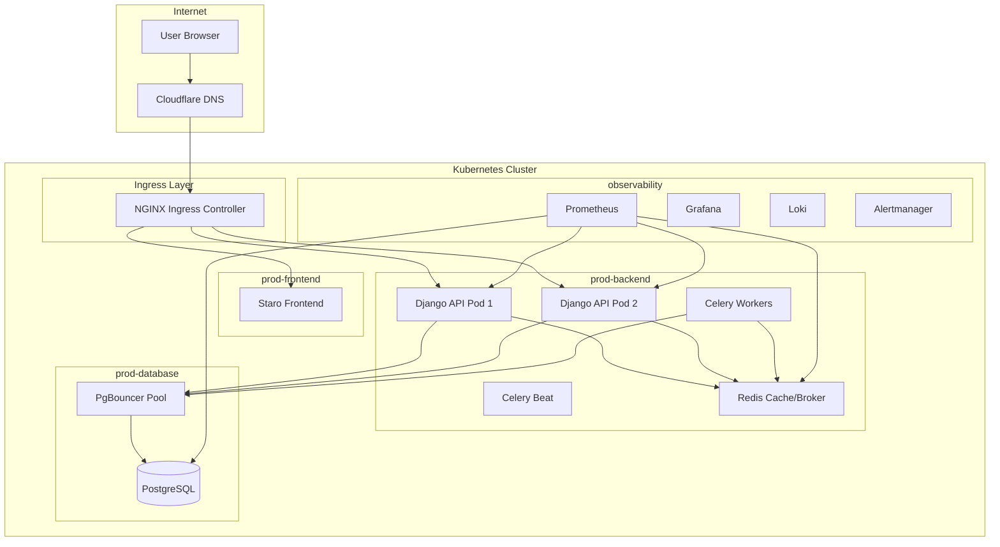
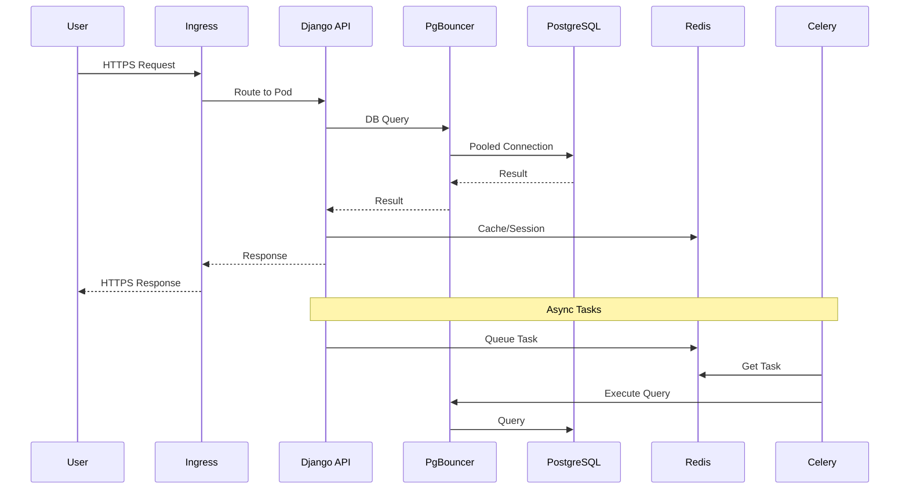
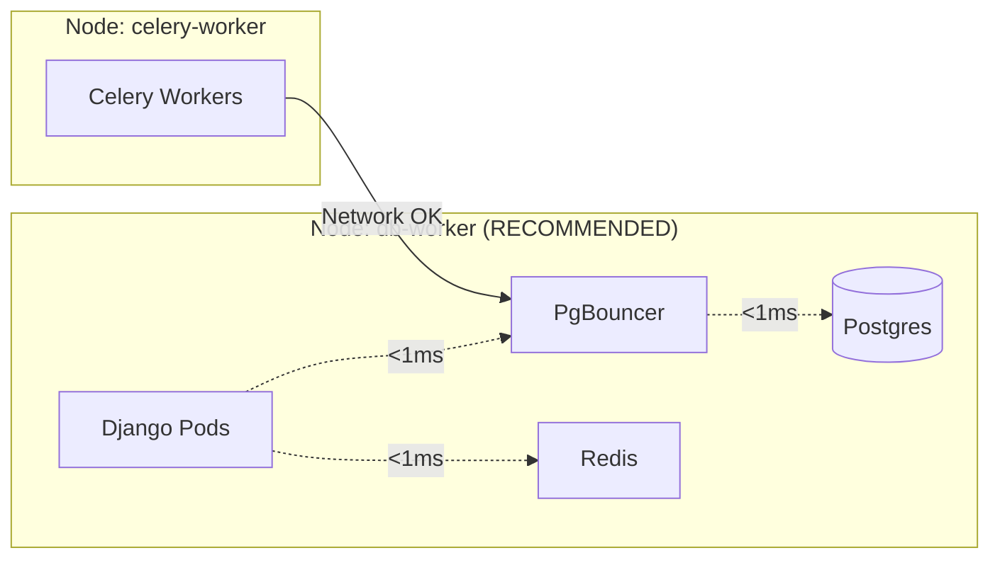
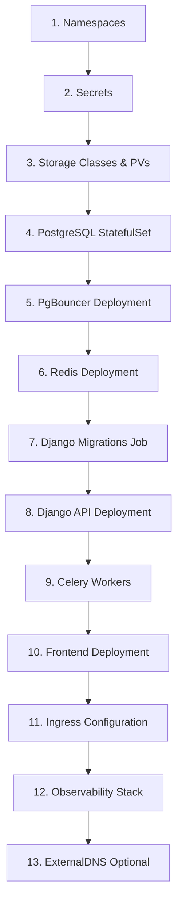

# Staro Modular - Production Deployment Guide

This guide provides step-by-step instructions for deploying the Staro Modular multi-tenant SaaS platform on Kubernetes. It includes architecture diagrams, best practices, and lessons learned from production deployments.

---

## Table of Contents
1. [Architecture Overview](#1-architecture-overview)
2. [Prerequisites](#2-prerequisites)
3. [Cluster Setup](#3-cluster-setup)
4. [Deployment Order](#4-deployment-order)
5. [Component Deep Dive](#5-component-deep-dive)
6. [Observability Stack](#6-observability-stack)
7. [Production Best Practices](#7-production-best-practices)
8. [Troubleshooting Guide](#8-troubleshooting-guide)

---


## 1. Architecture Overview

### High-Level Architecture



### Data Flow Architecture



### Pod Colocation Strategy (Critical for Performance!)

> [!IMPORTANT]
> **All latency-sensitive pods MUST run on the same node.**
> This was the #1 performance issue we encountered.



---

## 2. Prerequisites

### Infrastructure Requirements

| Component | Minimum | Recommended | Notes |
|-----------|---------|-------------|-------|
| **Nodes** | 2 | 3+ | 1 control-plane + 2 workers |
| **CPU (per worker)** | 4 cores | 8 cores | For Django + DB |
| **RAM (per worker)** | 8 GB | 16 GB | PostgreSQL needs memory |
| **Disk** | 50 GB | 100 GB SSD | Local storage for Postgres |
| **Network** | 1 Gbps | 10 Gbps | Low latency critical |

### Software Requirements

| Tool | Version | Purpose |
|------|---------|---------|
| Kubernetes | 1.28+ | Container orchestration |
| kubectl | 1.28+ | Cluster management |
| Helm | 3.12+ | Package management |
| Docker | 24+ | Container runtime |

### Network Requirements

> [!CAUTION]
> **All worker nodes MUST be in the same datacenter/network segment.**
> Cross-datacenter latency will cause 5-30 second API response times.

```bash
# Test node-to-node latency (should be <1ms)
ping -c 5 <other-node-ip>
```

---

## 3. Cluster Setup

### Node Labeling Strategy

```bash
# Label nodes by location (critical for hybrid clusters)
kubectl label node <node-name> location=vps     # For VPS nodes
kubectl label node <node-name> location=home    # For home nodes
kubectl label node <node-name> nodepool=workers # For worker nodes

# Label the database node specifically
kubectl label node <db-node> role=database
```

### Create Namespaces

```bash
kubectl apply -f namespaces/production.yaml
```

The namespaces file creates:
- `prod-backend` - Django, Celery, Redis
- `prod-database` - PostgreSQL, PgBouncer
- `prod-frontend` - Frontend application
- `observability` - Monitoring stack

---

## 4. Deployment Order

> [!IMPORTANT]
> Follow this order exactly. Each step depends on the previous.

### Quick Reference

```bash
# Step 0: Preflight checks
./scripts/00-preflight.sh

# Step 1: Create secrets
./scripts/01-create-secrets.sh

# Step 2: Apply manifests
./scripts/02-apply.sh

# Step 3: Run migrations
./scripts/03-migrate.sh

# Step 4: Verify deployment
./scripts/04-verify.sh

# Step 5: Deploy observability
./scripts/06-deploy-observability.sh
```

### Detailed Deployment Order



---

## 5. Component Deep Dive

### Database Layer

#### PostgreSQL StatefulSet
File: [postgres-statefulset.yaml](file:///home/techadmin/k8s/staro-k8s/database/postgres-statefulset.yaml)

```yaml
# Key configurations:
spec:
  replicas: 1
  template:
    spec:
      nodeSelector:
        role: database  # Pin to specific node
      containers:
        - name: postgres
          image: postgres:16-alpine
          resources:
            requests:
              cpu: 500m
              memory: 1Gi
            limits:
              cpu: "2"
              memory: 4Gi
```

#### PgBouncer Connection Pooler
File: [pgbouncer.yaml](file:///home/techadmin/k8s/staro-k8s/database/pgbouncer.yaml)

> [!TIP]
> PgBouncer reduces connection overhead by 90%+ for multi-tenant apps.

```yaml
# Critical: Use Pod Affinity to colocate with Postgres
affinity:
  podAffinity:
    requiredDuringSchedulingIgnoredDuringExecution:
      - labelSelector:
          matchLabels:
            app: postgres
        topologyKey: kubernetes.io/hostname
        namespaces:
          - prod-database
```

### Backend Layer

#### Django API
File: [django-deployment.yaml](file:///home/techadmin/k8s/staro-k8s/backend/django-deployment.yaml)

```yaml
# Critical: Use Pod Affinity for performance
affinity:
  podAffinity:
    preferredDuringSchedulingIgnoredDuringExecution:
      - weight: 100
        podAffinityTerm:
          labelSelector:
            matchLabels:
              app: postgres
          topologyKey: kubernetes.io/hostname
          namespaces:
            - prod-database
```

#### Celery Workers
File: [celery.yaml](file:///home/techadmin/k8s/staro-k8s/backend/celery.yaml)

Celery workers can run on any node since they're async and latency-tolerant.

### Ingress Layer

File: [multi-tenant-ingress.yaml](file:///home/techadmin/k8s/staro-k8s/ingress/multi-tenant-ingress.yaml)

```yaml
# Multi-tenant routing example
apiVersion: networking.k8s.io/v1
kind: Ingress
metadata:
  annotations:
    nginx.ingress.kubernetes.io/proxy-body-size: "50m"
    cert-manager.io/cluster-issuer: letsencrypt-prod
```

---

## 6. Observability Stack

### Components

| Component | Purpose | Port |
|-----------|---------|------|
| Prometheus | Metrics collection | 9090 |
| Grafana | Visualization | 3000 (80 via ingress) |
| Loki | Log aggregation | 3100 |
| Alertmanager | Alert routing | 9093 |

### Deployment

```bash
# Add Helm repos
helm repo add prometheus-community https://prometheus-community.github.io/helm-charts
helm repo add grafana https://grafana.github.io/helm-charts

# Install kube-prometheus-stack
helm install kube-prometheus-stack prometheus-community/kube-prometheus-stack \
  -n observability \
  -f observability/prometheus-values.yaml

# Install Loki
helm install loki grafana/loki-stack \
  -n observability \
  -f observability/loki-values.yaml
```

### ServiceMonitors

File: [service-monitors.yaml](file:///home/techadmin/k8s/staro-k8s/observability/service-monitors.yaml)

> [!IMPORTANT]
> ServiceMonitors MUST have `release: kube-prometheus-stack` label to be discovered.

```yaml
metadata:
  labels:
    release: kube-prometheus-stack  # Required!
```

### Grafana Credentials

```bash
# Access: https://grafana.ostechnologies.info
# Username: admin
# Password: (from grafana-admin-credentials secret)
```

---

## 7. Production Best Practices

### Performance Checklist

- [ ] All Django/PgBouncer/Postgres pods on same node
- [ ] Network latency between nodes <1ms
- [ ] PgBouncer pool size matches expected connections
- [ ] Redis configured for LRU eviction
- [ ] Prometheus scrape interval not too aggressive (30-60s)

### Security Checklist

- [ ] All secrets in Kubernetes Secrets (not ConfigMaps)
- [ ] Network policies restrict pod-to-pod traffic
- [ ] Ingress uses TLS with valid certificates
- [ ] Database passwords have special characters
- [ ] RBAC configured for service accounts

### High Availability Checklist

- [ ] Django: 2+ replicas with PodDisruptionBudget
- [ ] PgBouncer: 2 replicas
- [ ] PostgreSQL: Consider CloudNativePG for replication
- [ ] Redis: Consider Sentinel or Cluster mode

---

## 8. Troubleshooting Guide

### Common Issues & Solutions

#### Issue: API Response Time 5-30 seconds

**Cause**: Pods on different network segments
**Solution**: Use Pod Affinity to colocate Django + PgBouncer + Postgres

```bash
# Check pod locations
kubectl get pods -A -o wide | grep -E "django|pgbouncer|postgres"

# Test latency
kubectl run -it --rm debug --image=busybox -- \
  sh -c "time nc -zv <pgbouncer-ip> 5432"
```

#### Issue: PgBouncer Exporter CrashLoopBackOff

**Cause**: Password contains special characters (#, @, etc.)
**Solution**: Use PGPASSWORD env var instead of embedding in DATABASE_URL

```yaml
env:
  - name: PGPASSWORD
    value: "$(PGBOUNCER_PASS)"
  - name: DATABASE_URL
    value: "postgres://postgres@localhost:5432/pgbouncer?sslmode=disable"
```

#### Issue: Grafana Datasource Conflict

**Cause**: Multiple datasources set as default
**Solution**: Set `isDefault: false` on Loki datasource

#### Issue: ServiceMonitors Not Working

**Cause**: Missing `release` label
**Solution**: Add `release: kube-prometheus-stack` to metadata.labels

---

## File Reference

### Directory Structure

```
staro-k8s/
├── backend/
│   ├── django-deployment.yaml    # Django API
│   ├── celery.yaml               # Celery workers
│   ├── celery-home.yaml          # Home node workers
│   ├── redis.yaml                # Redis cache
│   ├── django-migrate-job.yaml   # Migration job
│   └── django-rbac.yaml          # RBAC for Django
├── database/
│   ├── postgres-statefulset.yaml # PostgreSQL
│   ├── pgbouncer.yaml            # Connection pooler
│   ├── postgres-pv.yaml          # Persistent volume
│   └── local-storageclass.yaml   # Storage class
├── frontend/
│   └── staro-deployment.yaml     # Frontend app
├── ingress/
│   ├── multi-tenant-ingress.yaml # Main ingress
│   └── custom-domain-template.yaml
├── observability/
│   ├── prometheus-values.yaml    # Prometheus config
│   ├── loki-values.yaml          # Loki config
│   ├── service-monitors.yaml     # Metrics targets
│   ├── prod-alerts.yaml          # Alert rules
│   └── reporting/                # Daily reports
├── scripts/
│   ├── 00-preflight.sh          # Pre-deployment checks
│   ├── 01-create-secrets.sh     # Secret creation
│   ├── 02-apply.sh              # Apply manifests
│   ├── 03-migrate.sh            # Run DB migrations
│   ├── 04-verify.sh             # Verify deployment
│   └── 06-deploy-observability.sh
├── namespaces/
│   └── production.yaml           # Namespace definitions
└── network/
    └── network-policies.yaml     # Network security
```

---

## Quick Start for Fresh Environment

```bash
# 1. Clone repository
git clone <repo-url>
cd staro-k8s

# 2. Configure environment
cp database/prod.env.template database/prod.env
# Edit prod.env with your values

# 3. Label nodes
kubectl label node <node1> location=vps nodepool=workers role=database
kubectl label node <node2> location=vps nodepool=workers

# 4. Run deployment scripts
./scripts/00-preflight.sh
./scripts/01-create-secrets.sh
./scripts/02-apply.sh
./scripts/03-migrate.sh
./scripts/04-verify.sh
./scripts/06-deploy-observability.sh

# 5. Verify everything
kubectl get pods -A
```

---

*Generated: 2026-01-18 | Based on production deployment experience*
